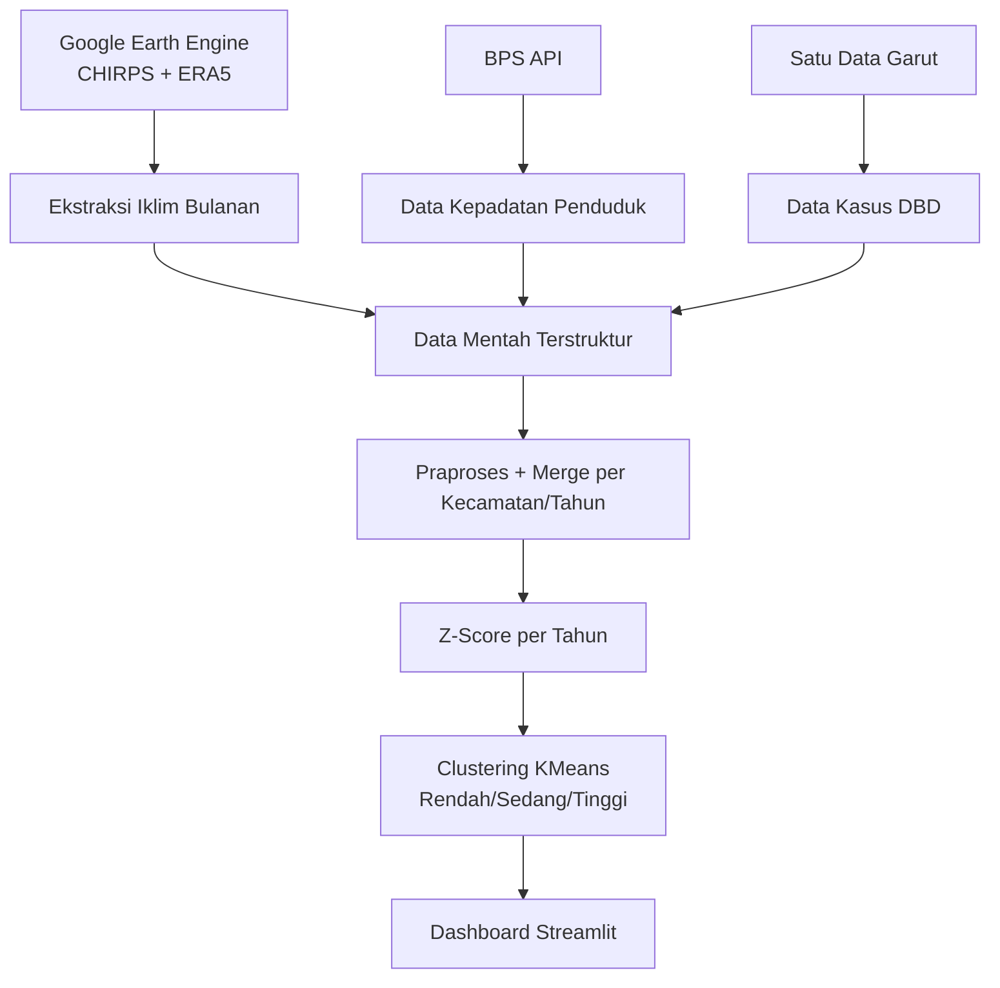

# Dashboard Peta Risiko DBD Kabupaten Garut

Proyek ini mengolah data iklim dan kependudukan untuk memetakan risiko DBD per kecamatan di Kabupaten Garut. Alur utama mencakup pengambilan data, praproses, normalisasi z-score, clustering risiko, dan visualisasi interaktif melalui dashboard Streamlit.

## Fitur Utama
- Pengambilan data iklim dari Google Earth Engine (CHIRPS dan ERA5)
- Pengambilan data kepadatan penduduk dari BPS dan kasus DBD dari Satu Data Garut
- Praproses dan penggabungan data per kecamatan dan tahun
- Perhitungan z-score per tahun
- Clustering KMeans menjadi kategori risiko (Rendah, Sedang, Tinggi)
- Dashboard peta interaktif dan tabel ringkasan

## Alur Data
1. Ambil data iklim bulanan (curah hujan, suhu, kelembapan) dari Google Earth Engine
2. Ambil data kepadatan penduduk (BPS) dan kasus DBD (Satu Data Garut)
3. Praproses dan gabungkan data per kecamatan dan tahun
4. Hitung z-score per tahun
5. Clustering KMeans untuk kategori risiko
6. Tampilkan hasil pada dashboard Streamlit

## Diagram Pipeline


## Struktur Proyek (Ringkas)
- main.py: menjalankan seluruh pipeline dan dashboard
- package/earth_engine: modul Google Earth Engine
- package/bps: modul pengambilan data BPS dan Satu Data Garut
- package/preprocess: praproses dan penggabungan data
- package/process: z-score dan clustering
- package/streamlit: dashboard Streamlit
- raw_data: hasil data mentah
- preprocess_data: hasil praproses
- processed_data: hasil akhir (z-score dan clustering)
- GARUT: shapefile kecamatan Kabupaten Garut (untuk dashboard)

## Prasyarat
- Python 3.9+
- Akun Google Earth Engine aktif
- API Key BPS

## Instalasi
1. Buat virtual environment (opsional)
2. Install dependensi:

```bash
pip install -r requirements.txt
```

## Konfigurasi Environment
Buat file .env di root proyek dan isi nilai berikut:

```env
GOOGLE_EARTH_ENGINE_PROJECT_NAME=your-gcp-project-id
GOOGLE_EARTH_ENGINE_SHAPEFILE=users/your-user/garut_kecamatan_asset
BPS_API_KEY=your_bps_api_key
```

Catatan:
- GOOGLE_EARTH_ENGINE_SHAPEFILE harus menunjuk ke asset FeatureCollection di Earth Engine (hasil upload shapefile kecamatan).
- Rentang tahun dapat diubah di package/config.py.

## Menjalankan Pipeline + Dashboard
Jalankan pipeline end-to-end (ambil data jika belum ada, praproses, clustering, lalu buka dashboard):

```bash
python main.py
```

Jika data mentah sudah ada di folder raw_data, proses pengambilan akan dilewati.

## Menjalankan Dashboard Saja
Pastikan file processed_data/merge_data_clustered.csv sudah tersedia, lalu:

```bash
streamlit run package/streamlit/streamlit_app.py
```

## Output Utama
- raw_data/*.csv: data mentah
- preprocess_data/merge_data.csv: hasil gabungan praproses
- processed_data/merge_data_zscore.csv: hasil z-score
- processed_data/merge_data_clustered.csv: hasil clustering risiko